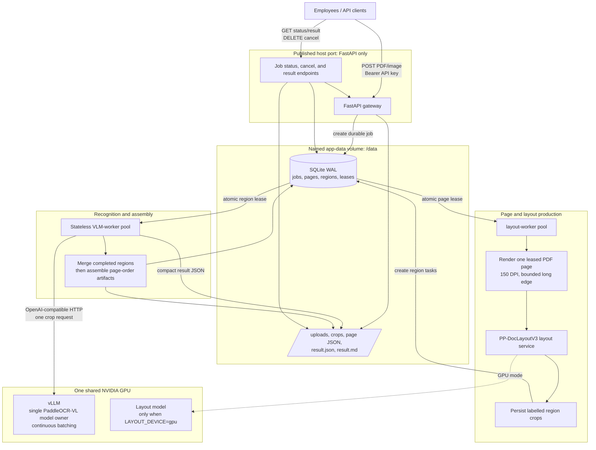

# Architecture Decision Record: from shared OCR pipeline to queued direct vLLM

## Purpose

This document records how the deployment evolved, why each architectural change
was made, what was measured, and what remains to be validated. It is an
engineering narrative, not a claim that every intermediate configuration was
production-ready.

The target environment is one on-premises host with local Docker volumes, a
single NVIDIA GPU, and many concurrent internal users submitting PDF documents.
The primary requirements are bounded memory, restart recovery, fair document
progress, and efficient use of the one GPU.

## Starting point: one shared in-process pipeline

The original shape was conventional but unsuitable for concurrent PDF work:

```text
client -> FastAPI -> shared PaddleOCRVL Python object -> GPU
```

The API process owned one `PaddleOCRVL` object and attempted to protect it with
a semaphore. This avoids some simultaneous access, but it does not create a
durable workload boundary. A long PDF keeps the request open, holds process
memory, and competes directly with every other request. If the process exits,
the in-flight state is lost. Increasing API workers would also duplicate Python
pipeline state and can create the same predictor/model contention that the
semaphore was intended to avoid.

This design had three important limits:

1. **The request lifecycle was the job lifecycle.** A client timeout, proxy
   timeout, or API restart affected document processing.
2. **A PDF was processed as a large unit.** A 60-page document could monopolize
   the pipeline and accumulate page-level memory/results in one process.
3. **Concurrency was not independently controllable.** API concurrency, PDF
   rendering, layout work, and VLM inference were coupled to one shared object.

The first decision was therefore not to increase threads. It was to separate
submission from processing and make the unit of recovery smaller than a PDF.

## First production architecture: FastAPI, SQLite, workers, and Triton/HPS

The first production-oriented design split the request path into durable work
stages:

```text
client
  -> FastAPI gateway
  -> SQLite job/page queue on /data
  -> page workers
  -> PaddleX HPS on Triton
  -> vLLM on the shared GPU
```

FastAPI accepted a PDF, streamed it to disk, validated page count/encryption,
and returned `202 Accepted` with a job URL. SQLite in WAL mode became the
durable source of truth. A page record was atomically leased to a worker; a
lease expiry made work recoverable after a worker crash. Page artifacts were
stored on disk rather than retaining Paddle result objects in memory.

This solved the lifecycle problem. The client could poll job status, cancel a
job, and fetch artifacts later. Workers could restart without losing the
document because the upload, page state, and result paths were already durable.

Triton/HPS was selected initially because it provided an official PaddleX
serving shape around PaddleOCR-VL: Triton request transport, model lifecycle,
an HPS Python backend, request grouping/batching, and the PaddleX pipeline's
model-specific VLM prompt/result handling. The HPS pipeline forwarded
recognition to one vLLM server rather than owning a GPU model in each worker.

That was a valid stability-first step: it removed the unsafe shared Python
model while retaining a supported PaddleX serving adapter.

## What the Triton phase exposed

Moving to Triton did not automatically maximize GPU utilization. Load tests and
container metrics showed a recurring pattern: Triton used substantial CPU while
the vLLM GPU process was often lightly loaded. GPU utilization around 20–30%
was observed even with multiple submitted PDFs.

Several causes were investigated and separated rather than treated as one
problem:

| Observation | Interpretation | Resulting decision |
|---|---|---|
| Only a few VLM requests were running and vLLM waiting was usually zero | The GPU was starved; adding GPU capacity would not help | Increase independent work available upstream |
| Triton CPU use approached the available CPU core count | Layout/pre/postprocessing was the bottleneck | Decouple layout from HPS recognition |
| A single PDF created limited independent work | Page-at-a-time scheduling exposed too little VLM parallelism | Add look-ahead and region-level work |
| vLLM had a waiting backlog but GPU was still moderate | vLLM admission/batching limits were conservative | Tune memory, sequences, and batched tokens incrementally |
| HPS configuration/model startup failures appeared | The HPS container/image/config is operationally complex | Avoid retaining it unless its adapter value is required |

The HPS deployment also produced practical integration problems during setup:
image availability, dependency download timeouts, container script permissions,
model-name/config mismatches, model-repository syntax errors, and GPU/CPU model
conversion incompatibilities. These are not reasons to reject Triton in every
system, but they increased the operational surface area for this single-model,
single-GPU deployment.

## Queue refinement: page queue plus region queue

The important throughput change was not simply raising worker counts. It was
changing the unit supplied to the VLM from a whole page to a layout crop.

```text
PDF job
  -> page task (durable lease)
  -> rendered page image
  -> layout detection
  -> region tasks (durable leases)
  -> independent VLM crop inference
  -> page merge
  -> document artifact assembly
```

The two queues are intentionally different:

| Queue | Unit | Responsibility |
|---|---|---|
| Page queue | PDF page | Fair scheduling, bounded rendering/layout look-ahead, job cancellation, and page recovery |
| Region queue | Layout crop | Keeps recognition workers and vLLM supplied with many independent requests |

The SQLite implementation records task status, attempts, lease owner, and lease
expiry. A worker claims work with an atomic status update. Failed transient
requests can be retried; expired leases can be reclaimed. This is the mechanism
that makes multiple worker replicas safe. There is no shared `PaddleOCRVL`
instance in the API or worker processes.

`MAX_PAGES_PER_JOB` bounds how far a large PDF may get ahead of other jobs, and
`MAX_REGIONS_PER_PAGE` bounds dense-page fan-out. Those bounds are deliberate:
unbounded pre-rendering would improve short-term GPU supply at the cost of disk,
RAM, fairness, and cancellation latency.

## Decoupling layout from recognition

HPS originally owned both layout detection and VLM recognition. That coupled a
CPU-heavy layout model to the same serving layer that supplied the GPU. The
next decision was to run PP-DocLayoutV3 as a separate `layout` service and keep
it configurable through `LAYOUT_DEVICE`.

```text
layout-worker -> layout service (PP-DocLayoutV3) -> region queue
                                               -> VLM workers -> vLLM
```

This allowed two independent tuning axes:

- **CPU layout mode:** multiple layout replicas and controlled OpenMP threads
  use host CPU cores to feed the GPU.
- **GPU layout mode:** one layout replica shares the GPU with vLLM, eliminating
  the CPU layout bottleneck but requiring vLLM VRAM headroom.

The observed trade-off was expected. CPU layout can consume many cores and
starve recognition of crops. GPU layout increases crop supply but competes with
vLLM for the same GPU. The correct replica count is therefore hardware- and
measurement-dependent; it is not a fixed “more workers is better” number.

## Current architecture: direct vLLM recognition

The current implementation removes Triton from the running Compose stack. The
VLM worker uses a stateless HTTP client for the existing PaddleOCR vLLM server.
It sends one already-cropped image at a time to vLLM's OpenAI-compatible
`/v1/chat/completions` endpoint. vLLM remains the only owner of the VLM and GPU
state.



The responsibilities are now deliberately narrow:

| Component | Owns | Does not own |
|---|---|---|
| FastAPI | authentication, upload validation, job submission/status/result APIs | PDF inference state or model state |
| SQLite + `/data` | durable job/page/region state and artifacts | GPU scheduling |
| Layout workers/service | page rendering, layout detection, crop creation | VLM model state |
| VLM workers | region leases, HTTP submission, compact result persistence, page merge | a local VLM model |
| vLLM | continuous batching, GPU model memory, admission/scheduling | job durability or PDF lifecycle |

This is why removing Triton does not reintroduce the original shared-pipeline
failure: many worker processes may submit requests, but none owns or shares a
local PaddleOCR-VL predictor. The single vLLM server owns that mutable model
state and schedules concurrent requests.

## What was intentionally removed

For the current crop-based path, the following HPS pipeline capabilities were
not being used per request: layout detection, document preprocessing, page
restructuring, chart/seal stages, Markdown image output, and layout-block
merging. Layout is already done upstream, and document assembly is performed
from compact persisted JSON.

Triton/HPS therefore became mostly an adapter between a crop and vLLM. Removing
it simplifies deployment, removes a CPU-heavy middleware hop, and eliminates
the related Docker DNS/readiness failure surface.

## Important validation boundary

Direct vLLM is currently an architectural validation path, not automatic proof
of output equivalence. HPS/PaddleX previously supplied PaddleOCR-VL-specific
task prompt construction and structured result interpretation. The direct
client currently asks for the crop's labelled content in Markdown and wraps the
answer as one block. This is sufficient to test queueing, concurrency, GPU
utilization, restart behavior, and baseline extraction quality, but tables,
formulas, and specialised labels require representative output comparison.

Before declaring the direct path production-complete:

1. Replay representative region crops through the old HPS and direct paths.
2. Compare text, tables, formulas, reading order, and page Markdown.
3. Run concurrent long PDFs, cancellation, retries, and worker restart tests.
4. Confirm that direct vLLM improves end-to-end throughput or materially
   reduces operational cost without reducing accepted output quality.

If output parity is not adequate, the smallest corrective step is to reproduce
only the required PaddleOCR-VL prompt/parser behavior in the direct client. Do
not restore a shared local pipeline merely to regain those features.

## Operating and tuning the current structure

The system now has two independent backpressure signals:

- **Region queue depth:** whether layout is producing crops faster than VLM
  workers consume them.
- **vLLM `running` and `waiting` metrics:** whether vLLM can admit and batch
  the submitted crop requests.

Interpret them together:

| Region queue | vLLM waiting | Likely bottleneck |
|---|---:|---|
| Low | Near zero | Layout/page production or incoming load is insufficient |
| Growing | Near zero | Worker submission, request failures, or vLLM configuration issue |
| Growing | Sustained above zero | vLLM/GPU is the limiting stage; additional VLM workers will not help |
| Stable | Sustained above zero | Desired controlled backlog, provided latency remains acceptable |

For a shared 24 GB GPU, begin with one GPU layout replica and conservative vLLM
memory headroom. Increase `max-num-batched-tokens` before raising worker count
when requests wait and GPU use is moderate. Increase `max-num-seqs` only after
token batching is adequate. Reduce `gpu-memory-utilization` if layout failures
or CUDA OOM occur. The detailed starting profiles and scheduler commands are
in the main [README](../README.md#tune-vllm-for-available-hardware).

## Decision summary

The architecture moved from **one shared pipeline** to **durable queued work**,
then from **page-level** to **region-level** recognition, then from **coupled
HPS layout/recognition** to **separate layout and vLLM stages**, and finally to
**direct stateless vLLM requests**. Each change was driven by a measured or
operationally observed constraint: unsafe shared state, recovery gaps, CPU
starvation, insufficient GPU work, HPS complexity, or an avoidable middleware
hop.

The central invariant has stayed the same: only vLLM owns the VLM/GPU model
state; every other process is stateless and recoverable from durable queue and
artifact state.
