# Request Flow

## Current deployment architecture

```mermaid
flowchart LR
    CLIENTS["Employees / API clients"]

    subgraph HOST["Single on-premises host"]
        API["FastAPI gateway<br/>only published service<br/>Bearer authentication"]

        DATA[("Shared app-data volume /data<br/>SQLite WAL job queue<br/>uploads, page JSON, result files")]

        subgraph WORKERS["PDF worker pool"]
            W["4 worker processes<br/>1 claimed page per process<br/>up to 4 concurrent pages total"]
            FAIR["SQLite scheduler<br/>round-robin across jobs<br/>maximum 2 running pages per PDF"]
        end

        subgraph TRITON["PaddleX HPS on Triton — internal HTTP :8000"]
            ROUTER["Triton default scheduler<br/>no dynamic batching"]

            subgraph INSTANCES["layout-parsing instance_group — 4 × KIND_CPU"]
                I1["Pipeline instance 1<br/>PP-DocLayoutV3 CPU<br/>VL concurrency ≤ 2"]
                I2["Pipeline instance 2<br/>PP-DocLayoutV3 CPU<br/>VL concurrency ≤ 2"]
                I3["Pipeline instance 3<br/>PP-DocLayoutV3 CPU<br/>VL concurrency ≤ 2"]
                I4["Pipeline instance 4<br/>PP-DocLayoutV3 CPU<br/>VL concurrency ≤ 2"]
            end

            COMPACT["Normalize compact page result<br/>remove embedded images"]
        end

        VLLM["PaddleOCR-VL 1.6 0.9B<br/>vLLM — internal HTTP :8118<br/>single NVIDIA GPU<br/>continuous batching<br/>max-num-seqs = 2"]

        SETUP["model-setup<br/>one-shot download"]
        MODELS[("models volume<br/>PP-DocLayoutV3")]
    end

    CLIENTS -->|"POST /parse/pdf<br/>multipart PDF"| API
    API -->|"stream + validate<br/>create job and page tasks"| DATA
    API -->|"202 job_id + URLs"| CLIENTS

    CLIENTS -->|"GET status / results<br/>DELETE cancellation"| API
    API <--> DATA

    DATA --> FAIR
    FAIR --> W
    W -->|"up to 4 simultaneous<br/>one-page JPEG requests"| ROUTER

    CLIENTS -->|"POST /parse/image<br/>synchronous"| API
    API -->|"shares the same HPS capacity"| ROUTER

    ROUTER --> I1
    ROUTER --> I2
    ROUTER --> I3
    ROUTER --> I4

    I1 -->|"up to 2 VL calls"| VLLM
    I2 -->|"up to 2 VL calls"| VLLM
    I3 -->|"up to 2 VL calls"| VLLM
    I4 -->|"up to 2 VL calls"| VLLM

    VLLM -->|"generated recognition output"| COMPACT
    I1 --> COMPACT
    I2 --> COMPACT
    I3 --> COMPACT
    I4 --> COMPACT
    COMPACT -->|"page response"| W
    W -->|"persist page JSON<br/>assemble ordered artifacts"| DATA
    COMPACT -->|"200 JSON + Markdown"| API

    SETUP -. startup only .-> MODELS
    MODELS -. read-only mount .-> I1
    MODELS -.-> I2
    MODELS -.-> I3
    MODELS -.-> I4

    classDef public fill:#dbeafe,stroke:#2563eb,color:#172554;
    classDef storage fill:#fef3c7,stroke:#d97706,color:#451a03;
    classDef cpu fill:#dcfce7,stroke:#16a34a,color:#052e16;
    classDef gpu fill:#f3e8ff,stroke:#9333ea,color:#3b0764;
    classDef note fill:#f3f4f6,stroke:#6b7280,color:#111827;

    class CLIENTS,API public;
    class DATA,MODELS storage;
    class W,FAIR,ROUTER,I1,I2,I3,I4,COMPACT cpu;
    class VLLM gpu;
    class SETUP note;
```

### Concurrency boundaries

1. The gateway can accept many PDF submissions quickly, but the durable queue is
   limited to 20 queued/running jobs by default.
2. Four worker processes allow at most four claimed pages to be processed at
   once across all PDFs. One PDF may occupy at most two workers; multiple jobs
   progress round-robin.
3. Triton has four independent CPU `layout-parsing` pipeline instances. With
   dynamic batching disabled, it distributes separate page requests among those
   instances instead of combining them.
4. Each HPS pipeline instance permits at most two concurrent VL calls, giving a
   theoretical HPS fan-out of eight calls. The actual number depends on detected
   page regions and available worker requests.
5. All HPS instances share one vLLM server and one GPU. The checked-in
   `max-num-seqs: 2` allows two active vLLM sequences; additional VL calls wait in
   vLLM while continuous batching keeps the GPU work shared.
6. Synchronous image requests use the same Triton instances and vLLM capacity as
   PDF workers, so image and PDF traffic can compete under load.

The diagram shows the default `LAYOUT_DEVICE=cpu` deployment. Selecting GPU
layout switches `layout-parsing` to the GPU configuration with one Triton
instance, which then shares the GPU with vLLM.

## PDF

1. FastAPI authenticates the bearer token and streams the upload to `/data`.
2. `pypdfium2` rejects encrypted/corrupt PDFs and enforces `MAX_PAGES`.
3. FastAPI atomically creates one SQLite job and one task per page, then returns
   202 without waiting for OCR.
4. Four worker processes claim tasks under `BEGIN IMMEDIATE`. Jobs are selected
   by least-recent claim, so multiple documents progress round-robin; one
   document may run at most two pages concurrently.
5. A worker renders only its claimed page at 150 DPI, capped to 2400 pixels on the
   long edge, and submits that JPEG to Triton's internal HTTP inference endpoint.
   CPU layout mode provides four independent Triton pipeline instances.
6. The compact response is stripped of embedded images and persisted immediately.
   The rendered JPEG and PDF/page/image objects are released after the request.
7. Expired leases are reclaimed after crashes. Transient Triton/vLLM errors receive
   three retries with bounded backoff. Cancellation prevents new claims.
8. The last worker reads compact results in page order and streams `result.json`
   and/or `result.md` to temporary files, then atomically renames them.
9. Hourly cleanup removes terminal jobs older than 24 hours.

## Image

Images are streamed to a temporary file, sent synchronously through the same
Triton endpoint, normalized, returned as JSON plus Markdown, and deleted.
